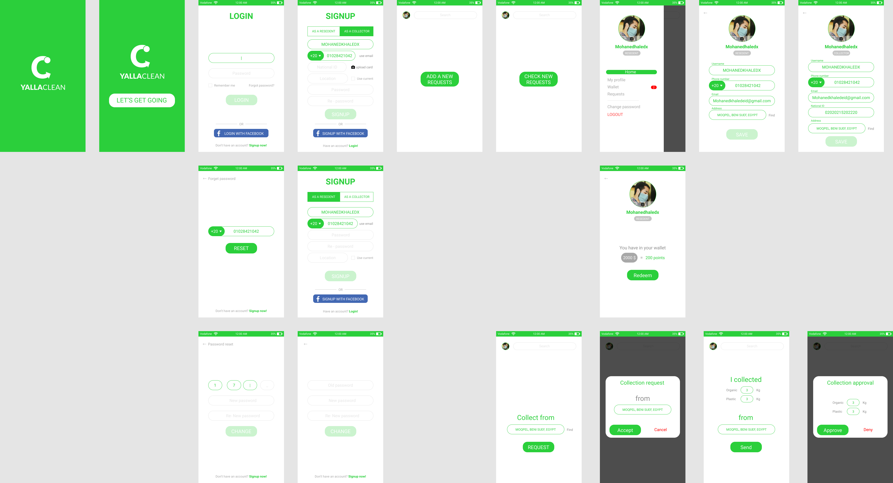
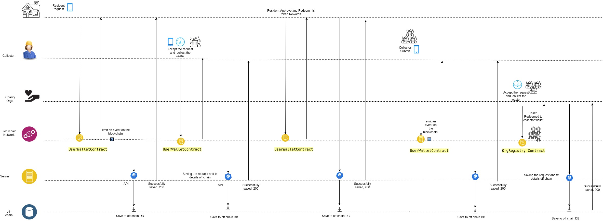

# Yallah Clean
====================================================

Overview 
---------
Yallah clean is a  new innovation model for on-demand service for waste collection cycle based on blockchain via engaging all stakeholders in a trusted, traceable & win-win model.

 Direct Beneficiaries:  
---------

- Individuals in all social classes
- Cleaning companies
- Waste recycling plants

 
The issue  
---------
In developing countries garbage is a chronic obstacle up to a point that  individuals get used to seeing dirt everywhere which has led to a negative change in individuals' attitudes regarding dirt and environmental pollution causing big health and environmental issues all the universe is suffering from.

If we tried to break down the main reasons that have led to the current situation, we can see the following :
---------------------------------------------------
- Some slums area is not covered by any civil services 
- The service in provinces are not stable and suffer from dereliction
- Good service requires higher cost which in developing countries is a big challenge for the government.   
- The individual behaviors have been changed negatively and the dereliction spirit is increasing significantly 
 Corruption due to lack of accountability from the government to cleaning companies. 
- No trusted traceable system from cleaning companies to highlight the covered regions. 
 - Waste separation and recycling add extra cost for Waste recycling plants. 
- Gang of rubbish collectors have appeared and they make use of the homeless and poor without providing any safety measures  to protect them when dealing with dirt and trying to separate it .
- People tend to deal with waste accumulation by burning it which makes things worse.

 The proposed solution 
---------

 An innovative model for the Garbage collection cycle based on blockchain where individuals are incentivized to act positively ( provide the waste separated so that waste recycling plants could make use of it with no extra cost) by being financially rewarded through a mobile app connected to the blockchain.

	
Contracts 
------------------
- YCAdminRole
- UserWallet
- OrgRegistry
- UserFactory
- YallaCleanToken
- BusinessPartnerWallet 

## The workflow would be like the following :
------------------
- Collector register/login ( with organization validation and confirmation  ) | resident/ household  login/register 
- Resident/ household  request the service via his mobile 
- The app match him with the nearest collector with illustration of the delivery time and location tracking 
- Clean collector takes the trash from resident/ household  x ( where resident/ household  x submit that transaction in the blockchain and collector approves it “ we need to adjust this in a better way, maybe we can use a kind of QRcode ?!“) 
- Once a collector approves collecting the trash from the resident/ household, the resident/ household is rewarded with 20% from the total points based on the quantities and types of wastes he sent. These points are transformed into tokens.
- Collector delivers the waste to cleaning company 
- Cleaning company validates his transaction and approves . Approving  include transferring token based on each delivery points   (80% for collector) 
- The cleaning company provides the waste to waste recycling plant in the form they agreed on with the cost they agreed on.
- Any participants in the network( including governments and individuals ) can track the transaction and see the covered areas though provided reports and graphs.
- We can, later on, let residents/ households donate to any social impact government program like helping homeless or treatment for addicts ( it might be part of the fees goes there as well)

Application Roles 
------------------

| Name       | Description                                                                                         |
|------------|-----------------------------------------------------------------------------------------------------|
| resident | A person Who request the service and get 20% of token for providing his waste seperated
| collector      | A person who deliver the service  and get 80% of tokens as payement for doing the job  |
Organization  carity or cleaning comapinies )       | orgs that act as a midel man between residnet and colector to validate collectors profile and collect the waste  in order to deliever it to the recycling plants | Busssiness partners | mainly for point system in countries that have issue using crypto , those parties can help in transforming the points/tokens in blockchain into goods, services ,etc                                     |

Workflow Details for a certain orgs/cleaning compainy
----------------

resident can register with  stratis address & email, “new wallet contract is generated and associated with this account  (on chain)“.

only when collector  submits a request to join ,
Kyc process is required  including submitting : 
	
- ID 
 - Photo

 Admin receives a notification for new request to be reviewed , after  reviewing KYC and he can accept or reject 
collector receives a notification for the status update

- Resident/ household  request the service via his mobile 
- The app match him with the nearest collector with illustration of the delivery time and location tracking 
- Clean collector takes the trash from resident/ household  x ( where resident/ household  x submit that transaction in the blockchain and collector approves it “ we need to adjust this in a better way, maybe we can use a kind of QRcode ?!“) 
- Once a collector approves collecting the trash from the resident/ household, the resident/ household is rewarded with 20% from the total points based on the quantities and types of wastes he sent. These points are transformed into tokens.
- Collector delivers the waste to cleaning company 
- Cleaning company validates his transaction and approves . Approving  include transferring token based on each delivery points   (80% for collector) 

 note that the platform can have multi org , and require a registeration process 
-----------------

# before you start 
-----------------
- install node v10.15.0  
- install ganache-cli  
- install truffle 
-  make sure you have android emulator 
  
# How to use
-----------------
- in a single terminal `ganache-cli`  
- in a single terminal run `npm install ` then `truffle migrate`  
-  in a single terminal `cd client` 
   -  `npm install` 
   -  `npm start `
-  in a single terminal in  client folder  
   - ` npm run android `
  
  make sure you have android emulator 
  -    make sure that your adb open tcp:8545 so that it can communicate with blockchain  by running `adb reverse tcp:8545 tcp:8545`
- Due to an issue in `truffle`  you need to add `"networkType": "ethereum",` to all contracts artifacts which is not migrated , if you are using vscode you can search for `"networks": {},` and replace it with `"networks": {},  "networkType": "ethereum",` to fix this issue . you can read more about the issue here where we have reported https://github.com/trufflesuite/truffle/issues/2903

  # Team
-----------------
- Eman Herawy 
- Ahmed AW
- Mohand Khaled
